# 교회 관리 SaaS 사용자 매뉴얼

본 매뉴얼은 `manualdemo` 데모 교회 화면 캡처를 기준으로 작성했습니다.

- 접속 주소: `http://manualdemo.localhost:3000`
- 관리자 계정: `admin`
- 비밀번호: `manual1234`
- 캡처 해상도: 1440x1000

> 참고: `28-member-detail.png`, `29-asset-detail.png`, `30-form-detail.png`, `31-form-assignments.png`, `32-form-report.png`는 초기 탐색 중 사이드바 링크가 잡힌 캡처입니다. 실제 상세 화면은 `38`~`42`번 이미지를 사용합니다.

---

## 1. 시작하기

### 1.1 로그인

교회별 서브도메인 주소로 접속한 뒤 관리자 계정으로 로그인합니다.

1. 아이디를 입력합니다.
2. 비밀번호를 입력합니다.
3. **로그인** 버튼을 누릅니다.

로그인에 성공하면 대시보드로 이동합니다.

### 1.2 대시보드

대시보드는 교회 운영 현황을 한 화면에서 확인하는 첫 화면입니다.

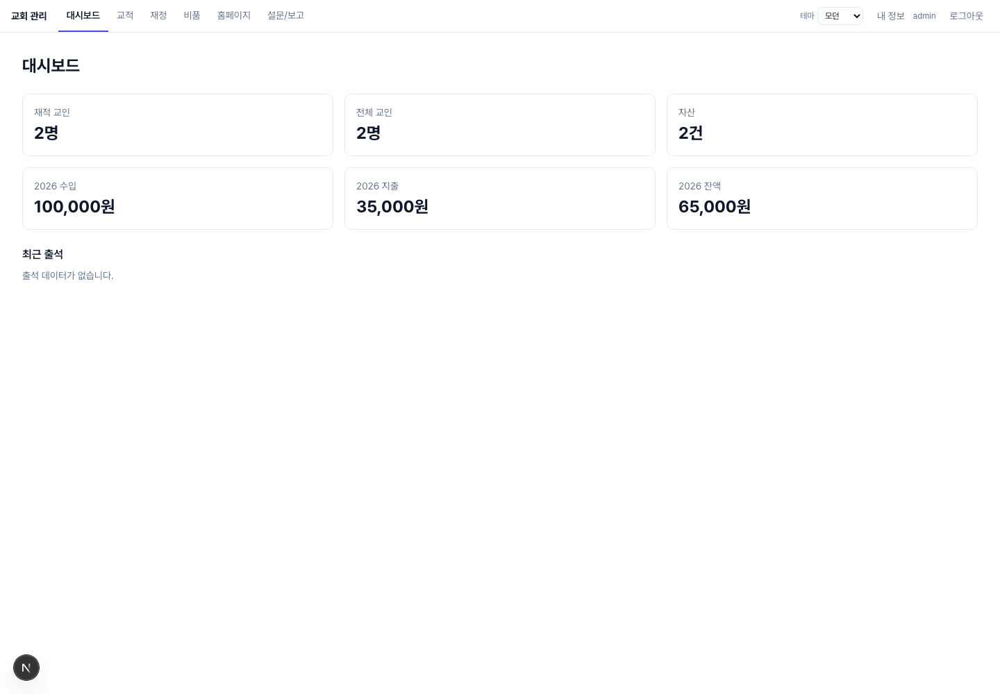

확인 가능한 항목:

- 재적 교인 수
- 전체 교인 수
- 자산 수
- 해당 연도 수입
- 해당 연도 지출
- 해당 연도 잔액
- 최근 출석 현황

상단 메뉴에서 주요 모듈로 이동합니다.

- **대시보드**
- **교적**
- **재정**
- **비품**
- **홈페이지**
- **설문/보고**
- **내 정보**

오른쪽 상단에서 테마를 변경하거나 로그아웃할 수 있습니다.

---

## 2. 교적 관리

교적 메뉴에서는 교인 정보, 가족, 출석, 목양 기록, 교육, 조직 편성, 문자/알림, 컴플라이언스 기능을 관리합니다.

### 2.1 교인 명단

교적의 기본 화면입니다. 교인 목록을 조회하고 이름/상태로 검색할 수 있습니다.

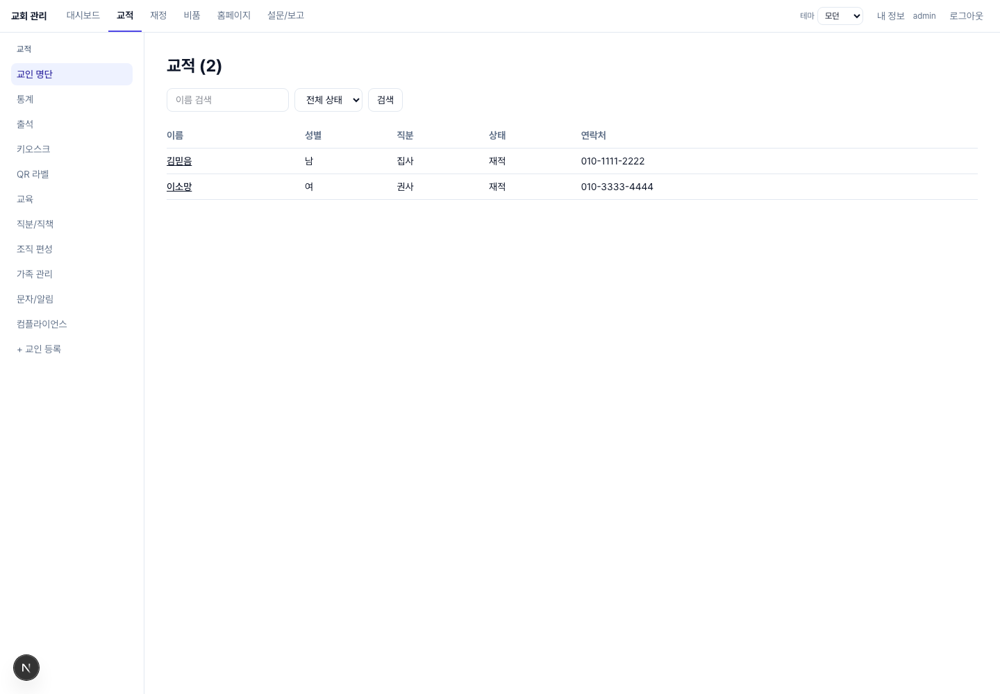

주요 기능:

- 교인 목록 조회
- 이름 검색
- 상태별 필터
- 교인 상세 화면 이동
- 페이지네이션

교인 이름을 클릭하면 상세 화면으로 이동합니다.

### 2.2 교인 상세

교인 한 명의 기본 정보와 목양 기록, 최근 출석, 셀프포털 계정 발급을 관리합니다.

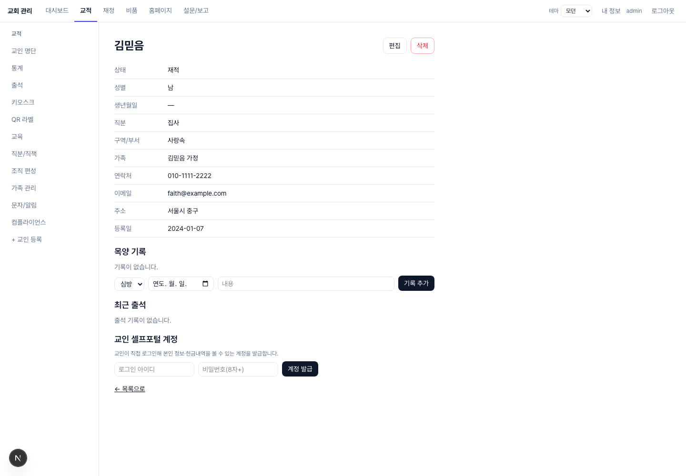

확인/관리 항목:

- 상태
- 성별
- 생년월일
- 직분
- 구역/부서
- 가족
- 연락처
- 이메일
- 주소
- 등록일
- 목양 기록
- 최근 출석
- 교인 셀프포털 계정

관리자는 이 화면에서 교인 정보를 편집하거나 삭제할 수 있습니다.

### 2.3 교적 통계

교인 데이터를 기준으로 기본 통계를 확인합니다.

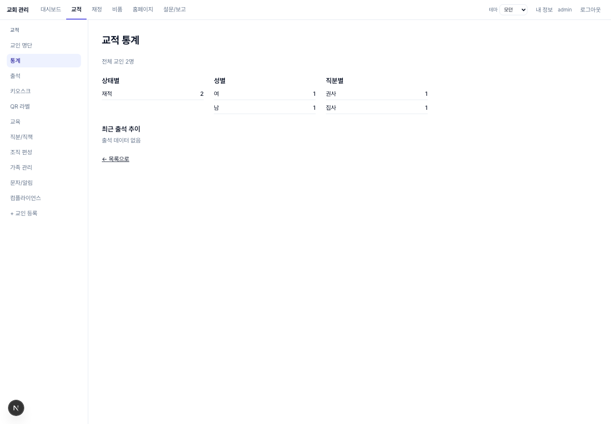

통계 항목:

- 전체 교인 수
- 상태별 통계
- 성별 통계
- 직분별 통계
- 최근 출석 추이

### 2.4 출석 관리

예배일과 예배 종류를 선택해 교인별 출석을 체크합니다.

사용 절차:

1. 예배 날짜를 선택합니다.
2. 예배 종류를 선택합니다.
3. 교인별 출석 여부를 체크합니다.
4. 저장합니다.

### 2.5 교육 관리

교육 과정을 만들고 교인을 수강 등록합니다.

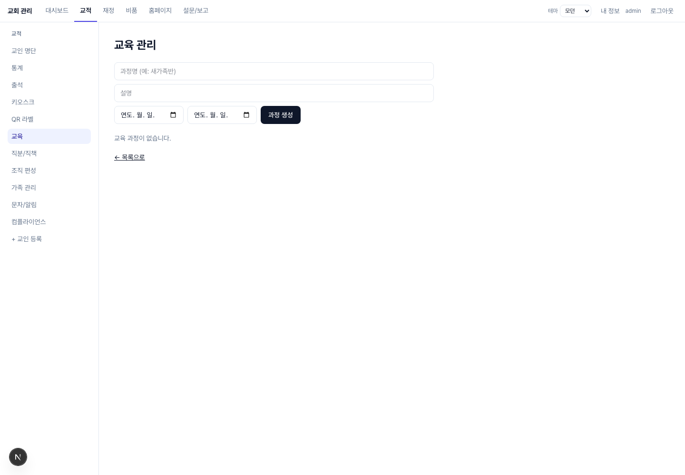

주요 기능:

- 교육 과정 생성
- 과정 설명 입력
- 시작일/종료일 관리
- 수강생 등록
- 수강 상태 변경

### 2.6 직분/직책 관리

교회별 직분과 조직 내 직책을 관리합니다.

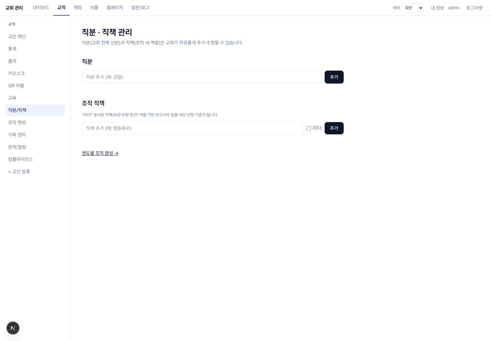

관리 항목:

- 직분 마스터
- 직책 마스터
- 리더 여부
- 사용 여부
- 정렬 순서

직분은 교인 기본 정보와 연결됩니다. 직책은 조직 편성과 보고서 자동 배정에 활용됩니다.

### 2.7 조직 편성

연도별로 교인을 부서/구역/속에 편성하고 직책을 부여합니다.

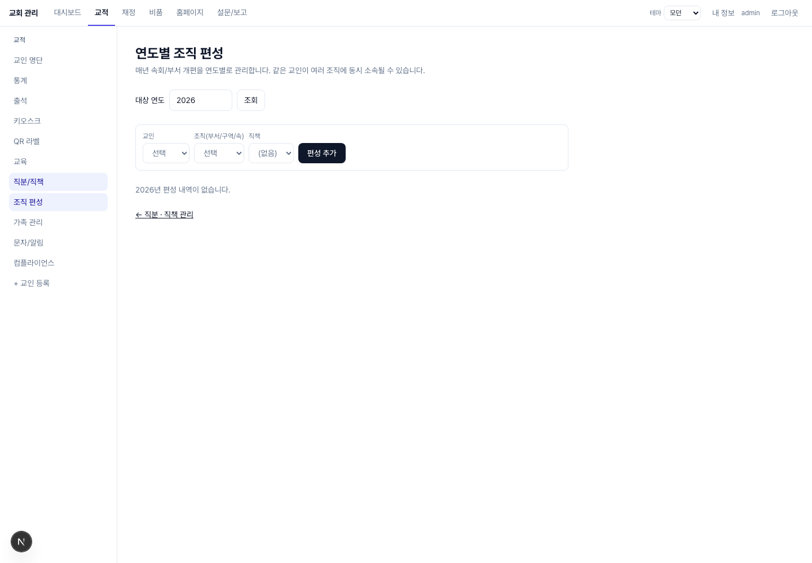

주요 기능:

- 연도별 편성
- 교인 선택
- 조직 선택
- 직책 선택
- 다중 소속 관리
- 리더 식별

### 2.8 QR 키오스크

교인 QR을 스캔하거나 교인을 선택해 오늘 주일예배 출석을 처리합니다.

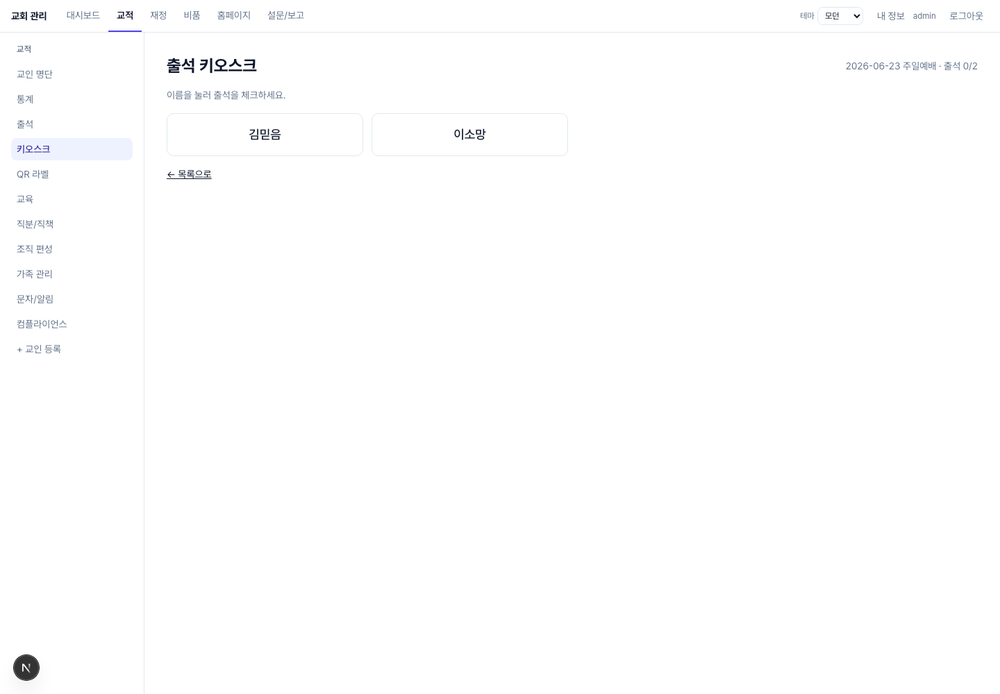

활용 예:

- 현장 출석 체크
- QR 링크 기반 빠른 체크인
- 키오스크용 별도 화면 운영

### 2.9 교인 QR 라벨

교인별 QR 라벨을 출력할 수 있습니다.

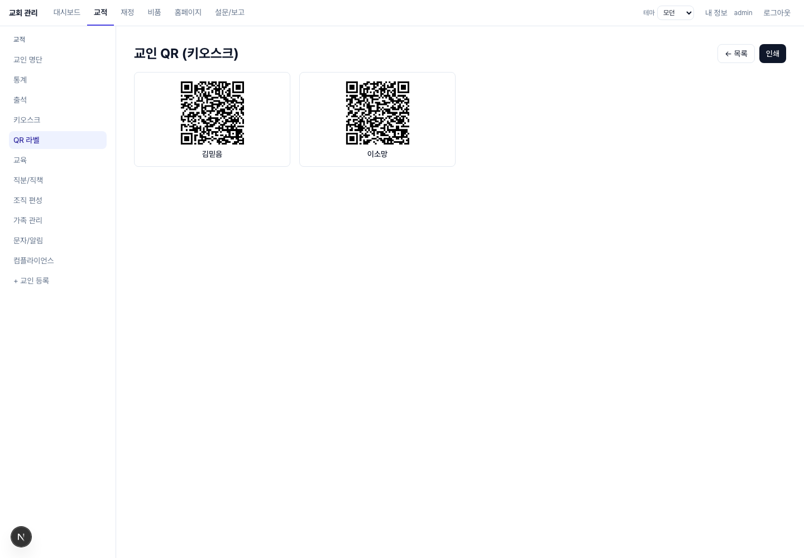

QR 라벨은 키오스크 출석 체크와 연결됩니다.

### 2.10 문자/알림

교인에게 문자/알림을 발송합니다.

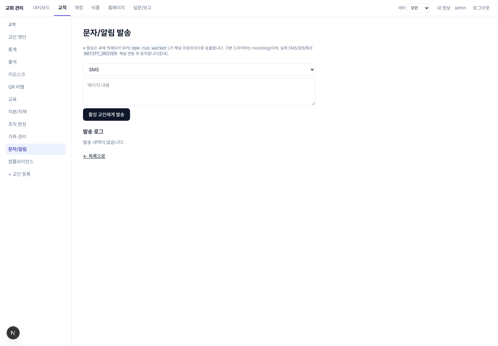

현재 구조:

- 발송 대상 선택
- 메시지 입력
- 큐 적재
- 워커 송출 처리
- 발송 상태 기록

기본 드라이버는 개발용 `log/mock`입니다. 실제 SMS/알림톡 발송은 별도 채널 드라이버 연동 후 사용합니다.

### 2.11 컴플라이언스

민감정보 접근 로그와 개인정보 동의 기록을 확인합니다.

확인 항목:

- 교인 상세 조회 접근 로그
- 개인정보 수집/이용 동의 기록
- 새가족 신청 동의 기록

---

## 3. 재정 관리

재정 메뉴에서는 계정과목, 전표, 예결산 보고서, 기부금영수증을 관리합니다.

### 3.1 전표 목록

수입/지출 전표를 조회합니다.

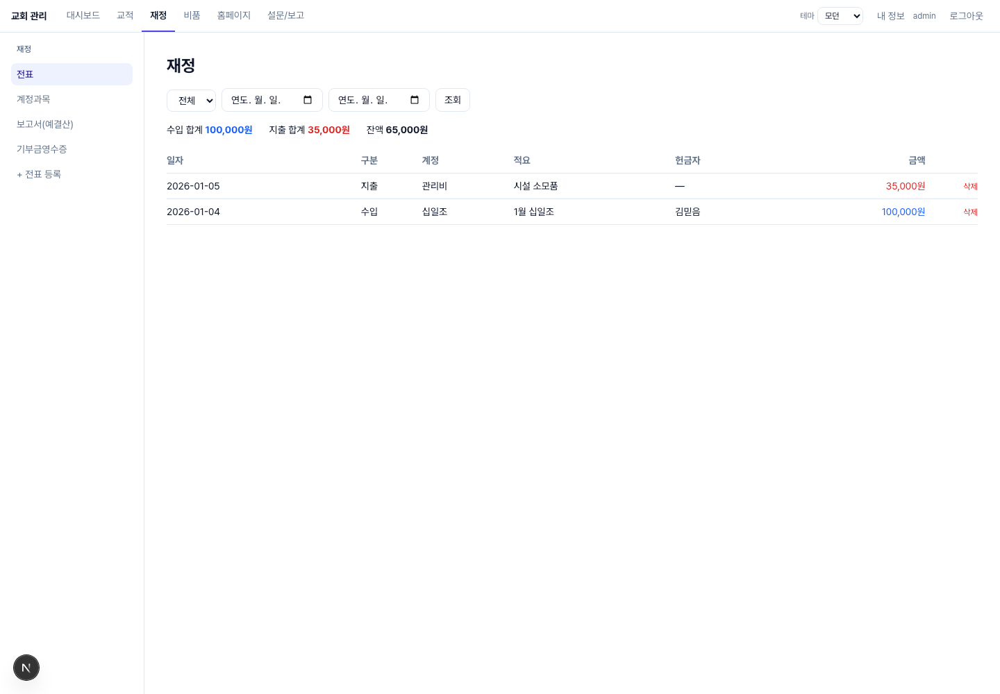

주요 기능:

- 전표 목록 조회
- 수입/지출 필터
- 기간 필터
- 수입 합계
- 지출 합계
- 잔액 확인
- 전표 삭제

### 3.2 계정과목

수입/지출 계정과목을 관리합니다.

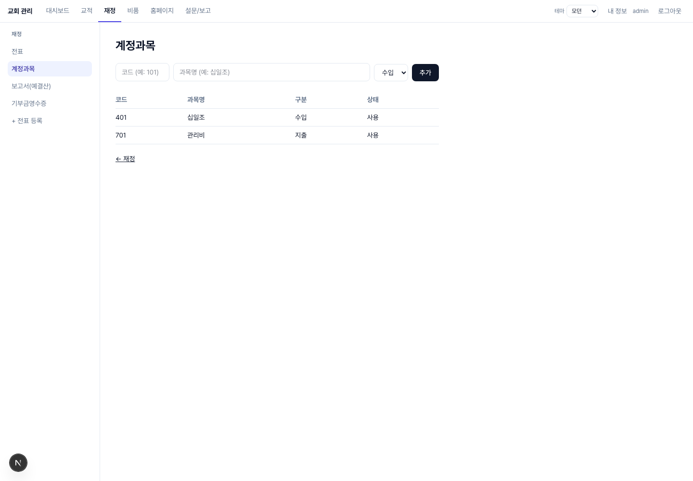

관리 항목:

- 코드
- 과목명
- 구분: 수입/지출
- 사용 여부

### 3.3 재정 보고서

기간별 수입/지출을 계정과목 기준으로 집계합니다.

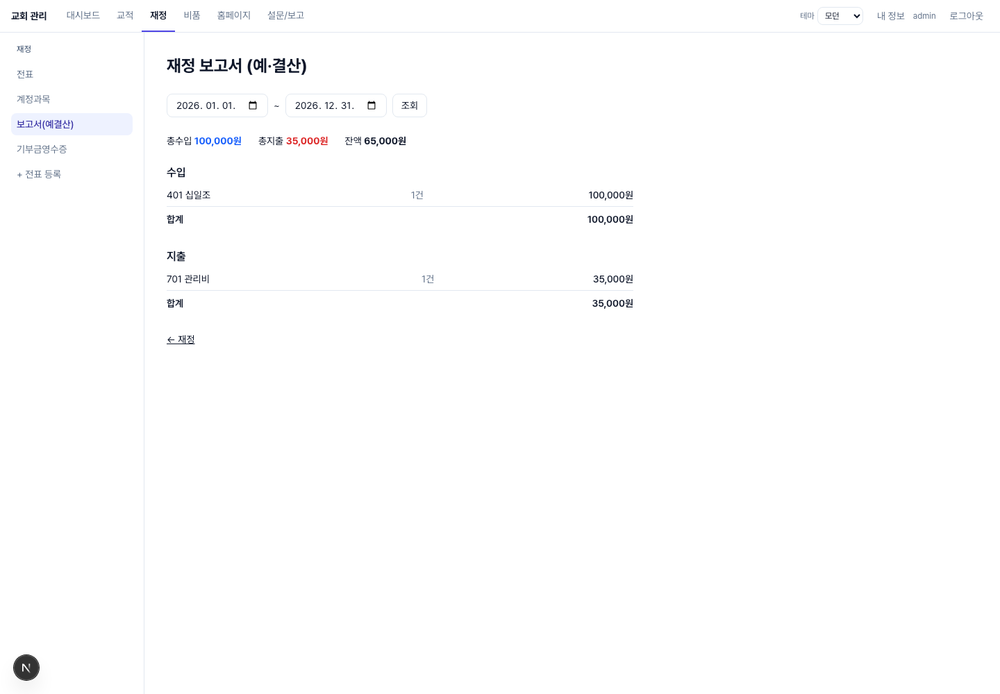

확인 항목:

- 조회 기간
- 총수입
- 총지출
- 잔액
- 수입 계정별 합계
- 지출 계정별 합계

### 3.4 기부금영수증

교인별 연간 헌금 합산 내역을 확인하고 영수증 출력 화면으로 이동합니다.

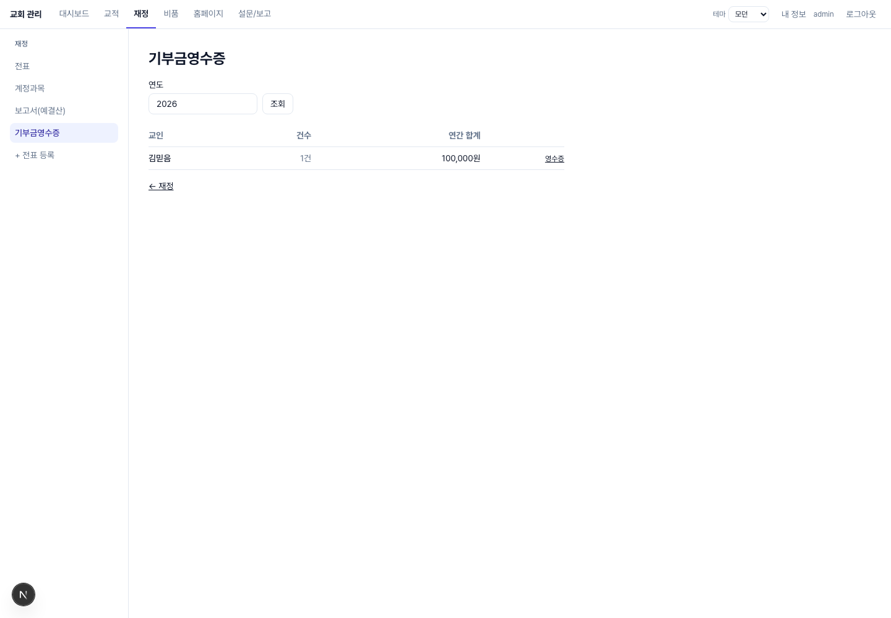

현재 제공 범위:

- 연도별 헌금 집계
- 교인별 헌금 합계
- 출력용 영수증 화면

국세청 전자 제출은 별도 연동 대상입니다.

---

## 4. 비품/자산 관리

비품 메뉴에서는 교회 자산, 분류, 수리이력, QR 라벨, 전수조사를 관리합니다.

### 4.1 자산 목록

등록된 자산을 조회합니다.

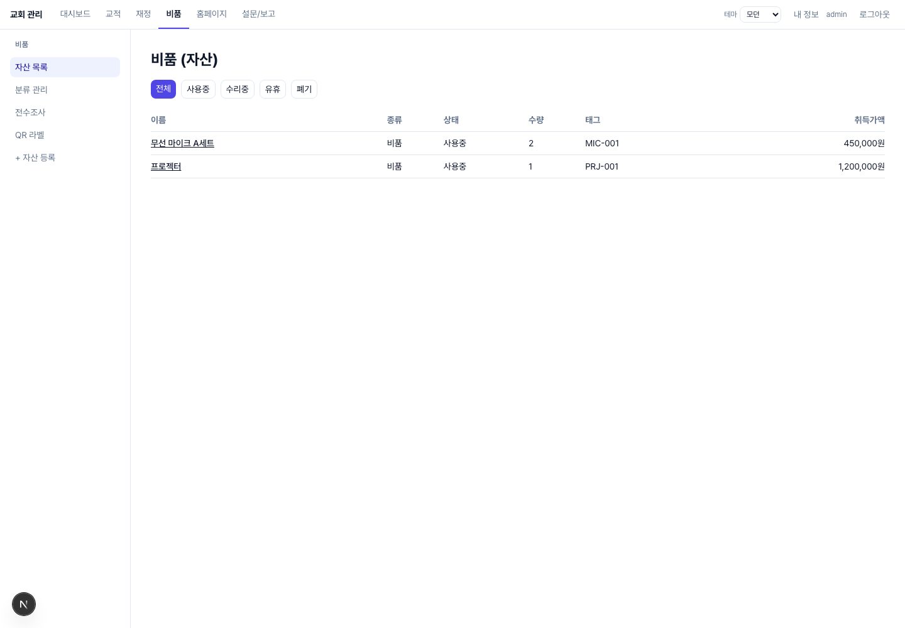

주요 기능:

- 자산 목록 조회
- 상태별 필터
- 자산명 클릭으로 상세 이동
- 수량 확인
- 태그 확인
- 취득가액 확인

### 4.2 자산 상세

자산의 상세 정보와 수리이력을 관리합니다.

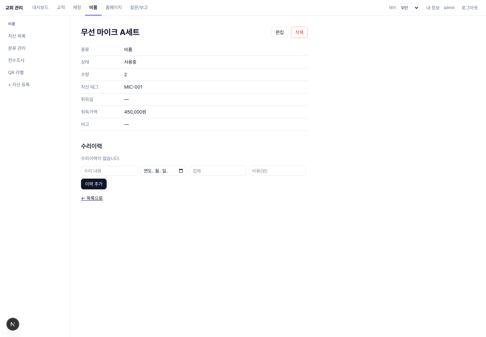

확인/관리 항목:

- 종류
- 상태
- 수량
- 자산 태그
- 취득일
- 취득가액
- 비고
- 수리이력

### 4.3 자산 분류 관리

자산 품목, 부서, 장소를 관리합니다.

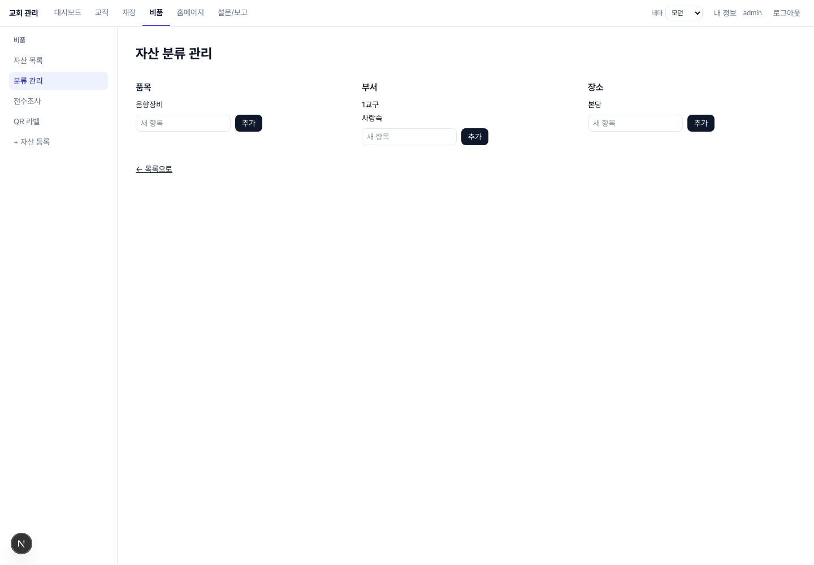

관리 항목:

- 품목
- 부서
- 장소

### 4.4 전수조사

자산 전수조사 세션을 만들고 진행 상태를 관리합니다.

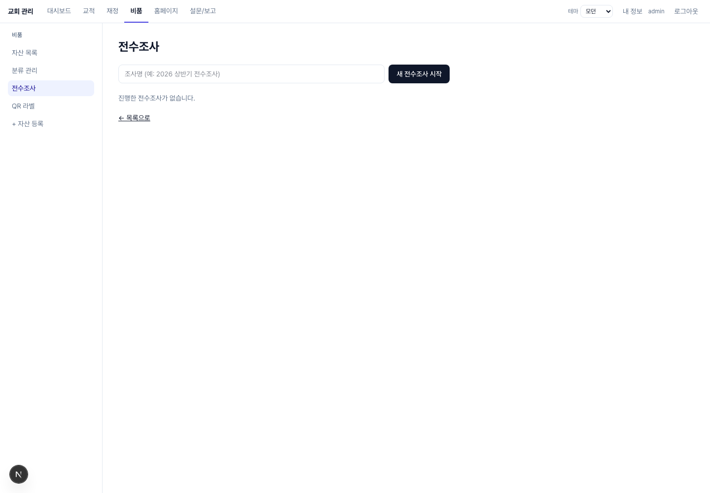

주요 기능:

- 전수조사 세션 생성
- 자산 스냅샷 생성
- 태그 스캔 체크
- 진행률 확인
- 조사 마감

### 4.5 자산 QR 라벨

자산별 QR 라벨을 출력합니다.

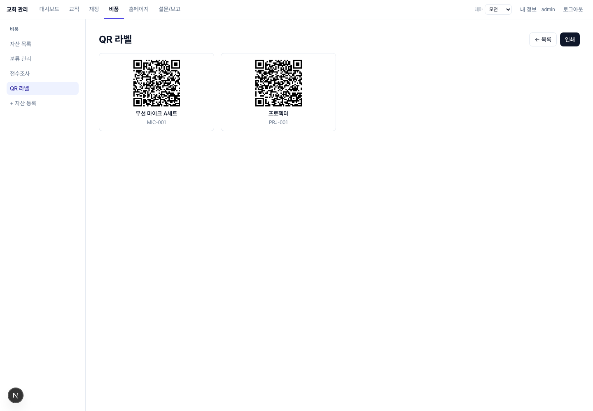

QR을 스캔하면 자산 상세 화면으로 이동합니다.

---

## 5. 홈페이지/CMS

홈페이지 메뉴에서는 공개 홈페이지, 게시판, 페이지, 새가족 접수, 온라인 헌금을 관리합니다.

### 5.1 홈페이지 관리

교회 홈페이지 상태와 테마, 게시판, 정적 페이지를 관리합니다.

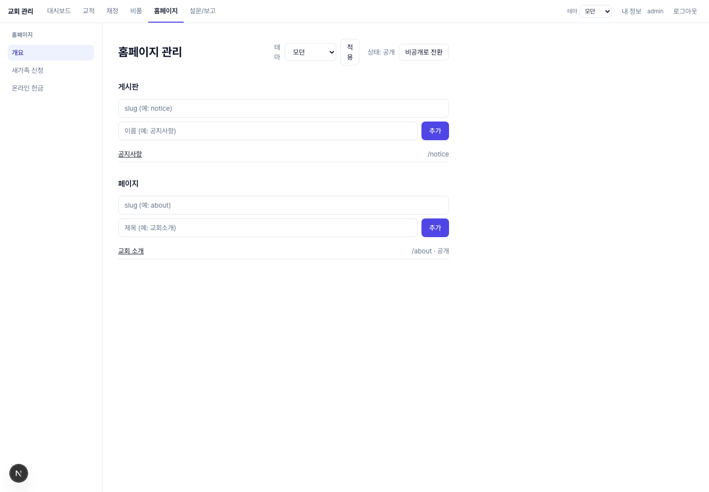

주요 기능:

- 홈페이지 공개/비공개 전환
- 테마 선택
- 게시판 생성
- 정적 페이지 생성
- 게시판/페이지 편집 화면 이동

### 5.2 새가족 접수 관리

공개 새가족 등록 폼으로 들어온 신청을 관리합니다.

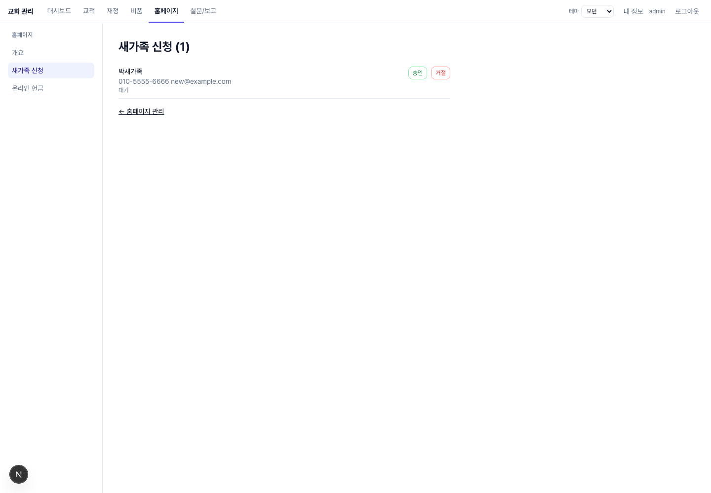

처리 상태:

- 대기
- 승인
- 거절

승인 시 교인으로 전환할 수 있습니다.

### 5.3 온라인 헌금 관리

공개 온라인 헌금 폼으로 접수된 내역을 관리합니다.

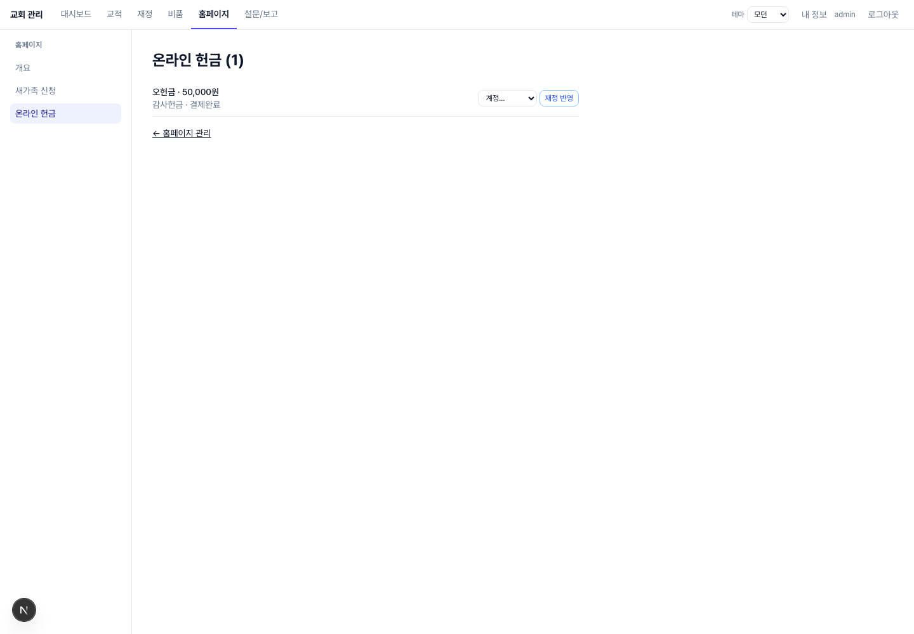

주요 기능:

- 온라인 헌금 접수 목록 확인
- 결제 상태 확인
- 재정 전표 반영

현재 결제는 mock 처리이며 실제 PG 연동은 별도 작업입니다.

---

## 6. 설문/보고

설문/보고 메뉴에서는 폼 템플릿, 문항, 배정, 응답, 집계를 관리합니다.

### 6.1 폼 목록

설문 또는 보고서 템플릿을 생성하고 목록을 조회합니다.

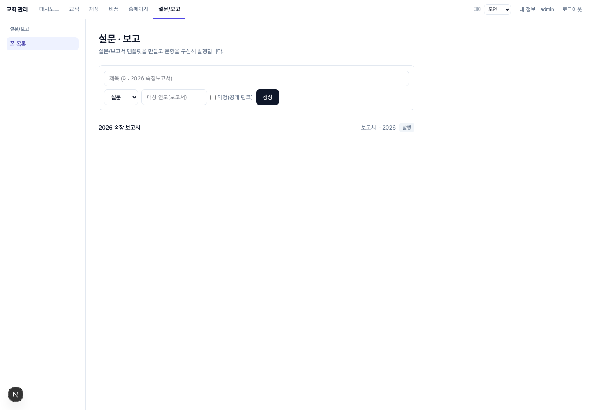

설정 항목:

- 제목
- 분류: 설문/보고서
- 대상 연도
- 익명 공개 여부

### 6.2 폼 상세

폼 정보와 문항을 편집합니다.

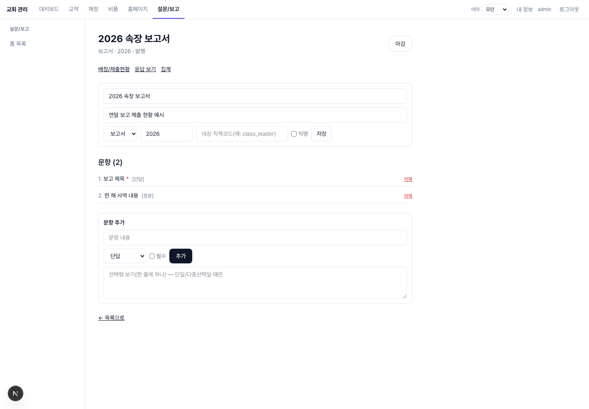

주요 기능:

- 제목 수정
- 설명 수정
- 설문/보고서 분류
- 대상 연도
- 익명 여부
- 발행/마감 상태 관리
- 문항 추가
- 문항 삭제

지원 문항 타입:

- 단답
- 장문
- 단일선택
- 다중선택
- 숫자
- 날짜
- 척도
- 파일첨부

### 6.3 제출현황

배정된 교인의 제출 상태를 확인합니다.

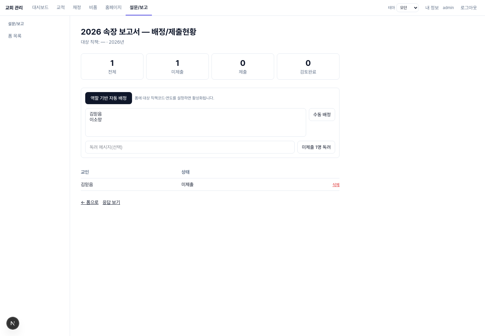

확인 항목:

- 대상 교인
- 제출 상태
- 미제출자
- 제출자
- 검토 완료 상태

역할/직책 기반 자동 배정 기능과 연결됩니다.

### 6.4 집계

응답 결과와 제출률을 집계합니다.

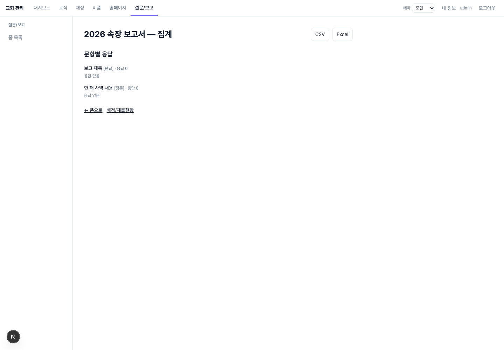

주요 기능:

- 문항별 응답 분포
- 조직별 제출률
- CSV 내보내기
- Excel 내보내기

---

## 7. 내 정보/온라인 교인센터

교인 계정으로 로그인한 사용자는 본인 정보와 본인에게 배정된 설문/보고를 확인합니다.

### 7.1 내 정보

본인 교인 정보를 확인합니다.

확인 항목:

- 이름
- 직분
- 연락처
- 이메일
- 등록일

### 7.2 나의 헌금내역

본인에게 연결된 헌금 내역만 조회합니다.

확인 항목:

- 헌금 누계
- 헌금 일자
- 항목
- 금액

### 7.3 내 설문/보고

본인에게 배정된 설문 또는 보고서를 확인하고 제출합니다.

상태:

- 미제출
- 제출
- 검토 완료

---

## 8. 공개 홈페이지

공개 영역은 로그인 없이 접근하는 홈페이지와 접수 폼입니다.

### 8.1 공개 홈

교회명, 주요 링크, 최근 소식을 표시합니다.

제공 링크:

- 새가족 등록
- 온라인 헌금
- 게시판
- 정적 페이지

### 8.2 공개 게시판

발행된 게시글만 공개됩니다.

### 8.3 공개 페이지

발행된 정적 페이지만 공개됩니다.

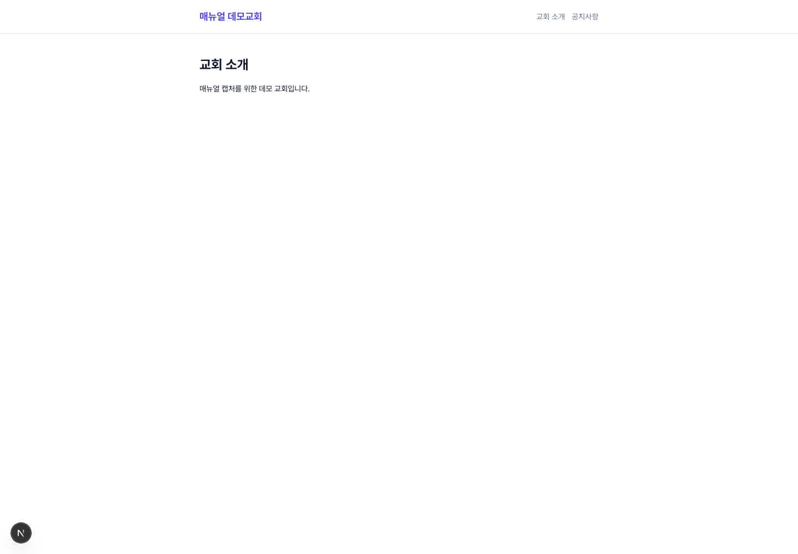

### 8.4 새가족 등록

방문자가 새가족 등록 신청을 제출합니다.

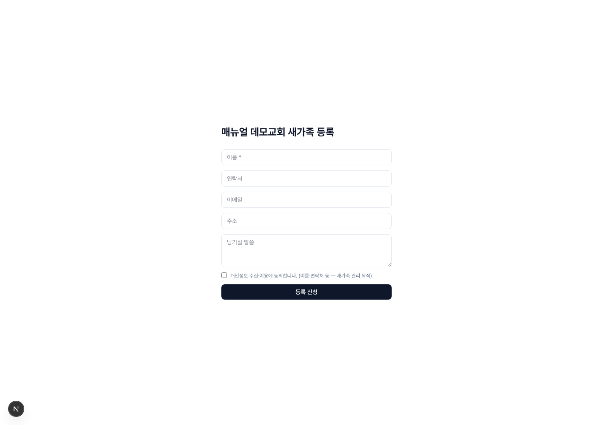

입력 항목:

- 이름
- 연락처
- 이메일
- 주소
- 메시지
- 개인정보 수집/이용 동의

### 8.5 온라인 헌금

방문자가 온라인 헌금 정보를 제출합니다.

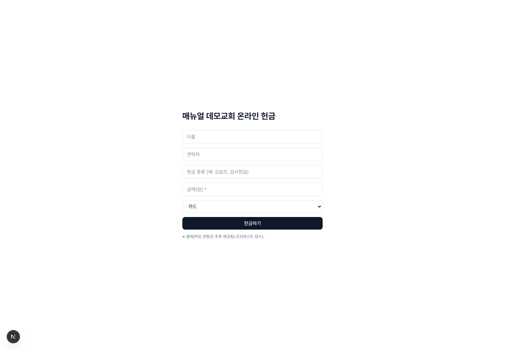

입력 항목:

- 헌금자명
- 연락처
- 헌금 종류
- 금액
- 납부 방식

현재 화면은 접수/mock 결제 기준입니다. 실제 PG 결제는 별도 연동 후 사용합니다.

---

## 9. 권한 기준

기본 역할은 다음과 같습니다.

| 역할 | 설명 |
|---|---|
| 관리자 | 전체 기능 접근 |
| 직원 | 교적/비품/홈페이지/설문 관리, 재정 읽기 |
| 열람 | 주요 데이터 읽기 |
| 교인 | 본인 정보, 본인 헌금내역, 본인 설문/보고 |

주요 권한:

- `members:read`: 교적 조회
- `members:write`: 교적 등록/수정/출석/교육/조직/알림
- `finance:read`: 재정 조회
- `finance:write`: 전표 등록/삭제
- `assets:read`: 자산 조회
- `assets:write`: 자산 등록/수정/전수조사
- `site:write`: 홈페이지/CMS 관리
- `forms:read`: 설문/보고 조회
- `forms:write`: 설문/보고 생성/배정/관리
- `church:manage`: 컴플라이언스 등 교회 관리 기능

---

## 10. 운영 전 확인할 항목

현재 데모 기준으로 화면과 기본 업무 흐름은 구성되어 있습니다. 운영 전에는 아래 외부 연동을 별도로 확인해야 합니다.

- 실제 PG 결제 연동
- 국세청 기부금영수증 전자 제출
- 실제 SMS/알림톡 드라이버
- 운영용 S3/SeaweedFS 설정
- 운영 도메인/TLS 설정
- 개인정보 보관/파기 정책
- 백업/복구 정책
