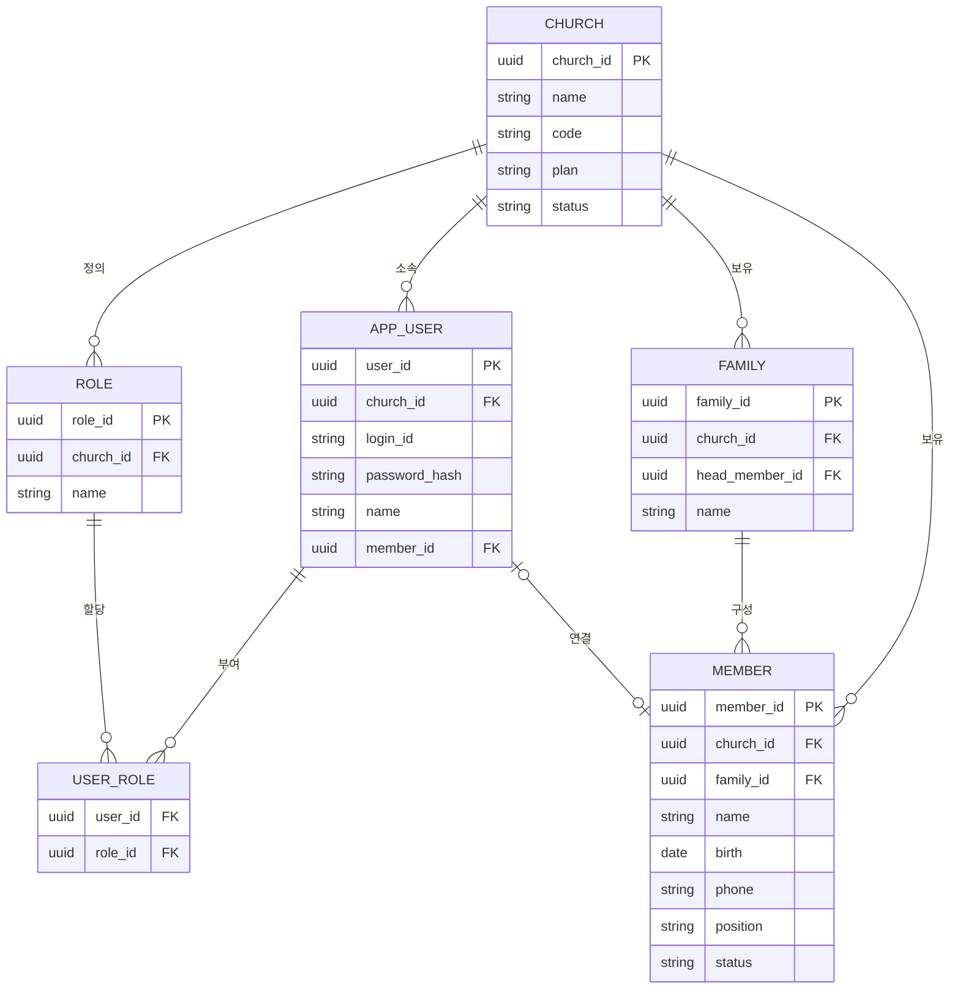
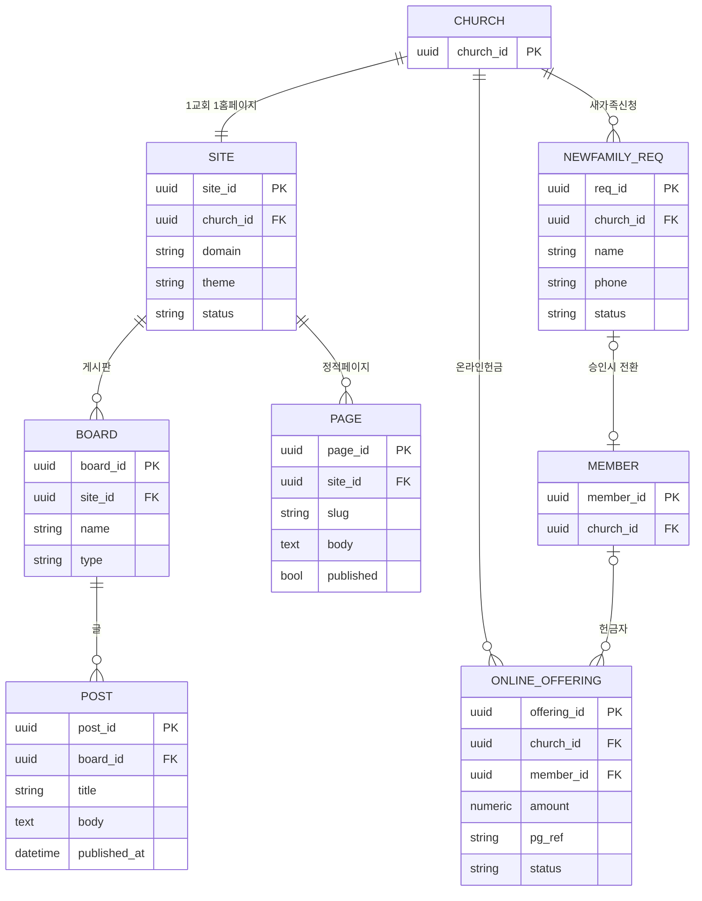
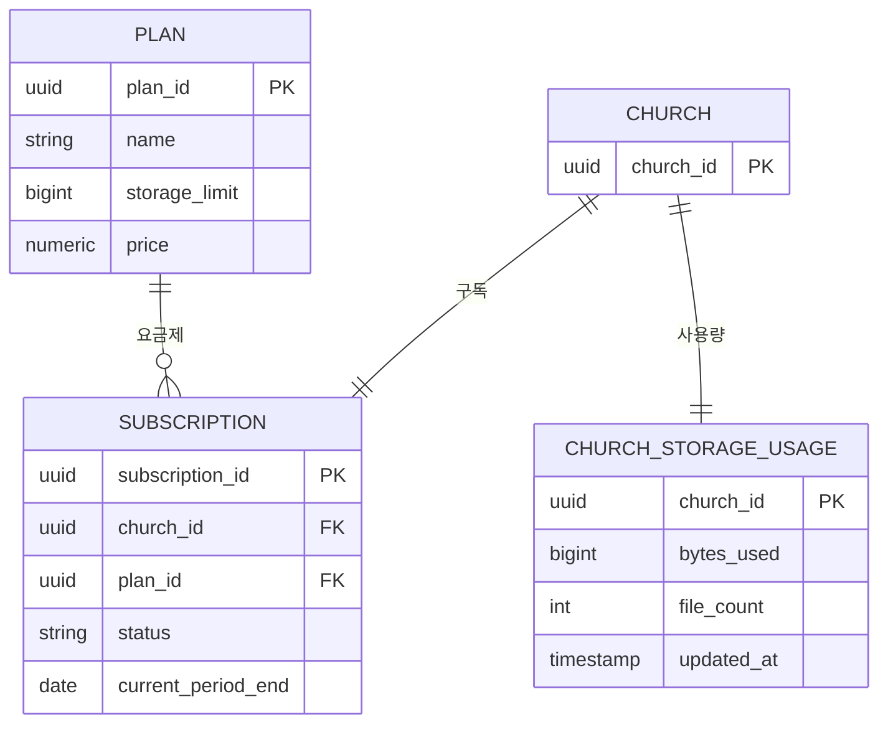

# 교회 관리 SaaS — 최종 개발 명세서 (Final Spec)

> 여러 교회가 함께 사용하는 멀티테넌트 교회 관리 SaaS.
> **이 문서는 모든 확정 결정을 반영한 최종 통합본**이며, 이전 초안(`church-saas-spec.md`, `phase-0-core-tasks.md`)을 대체합니다.
> **Claude Code 개발의 단일 기준 문서**로 사용합니다.

---

## 0. 한눈 요약 (TL;DR)

| 항목 | 결정 |
|---|---|
| 무엇 | 멀티테넌트 교회 관리 SaaS (ohjic 유사) |
| 모듈 | 비품(자산) · 교적 · 재정 · 홈페이지(CMS)+온라인교인센터 |
| 스택 | **nginx + Next.js 16 (App Router) + PostgreSQL** |
| 데이터 계층 | **Drizzle (SQL-first)** — 복잡 쿼리는 raw SQL/뷰. 대안: Kysely |
| 인증 | **Auth.js(JWT) 또는 경량 자체 JWT** + DB 리프레시/취소 기록 |
| CMS 레이어 | **코어는 미사용.** 홈페이지(Phase 4)에서 자체 CMS 테이블 또는 Payload 재검토 |
| 멀티테넌시 | 행 단위 `church_id` + **Postgres RLS** |
| 저장소 | 초기 로컬 디스크 → 확장 시 **SeaweedFS**(S3 호환), 교회 프리픽스 + 사용량 과금 |
| 백그라운드 잡 | **pg-boss / Graphile Worker** (초기 Redis 불필요) |
| 배포 | nginx + 여러 무상태 Next 인스턴스 + PgBouncer + 공용 스토리지 + 워커 |
| 개발 주체 | 1인 개발 (솔로 친화 우선) |

---

## 1. 결정 로그 (Decisions Log)

| 결정 | 근거 |
|---|---|
| 멀티테넌트(여러 교회) SaaS | ohjic 구조(`church_code`)와 동일한 목표 |
| nginx + Next 16 + PostgreSQL | SSR·자체 호스팅·금액 정확도(numeric)·RLS |
| **데이터 계층 = Drizzle (SQL-first)**, 복잡 쿼리는 raw SQL/뷰 | 무거운 ORM의 impedance mismatch 회피. 단순 CRUD는 타입 안전, 복잡 집계는 SQL로. 대안 Kysely |
| 인증 = JWT + DB 리프레시(취소 가능) | 무상태 수평 확장 + 강제 로그아웃 안전성. 민감정보라 영구 토큰 금지 |
| **코어에 Payload 미사용** | RLS 중심 설계와 마찰(요청별 세션 변수). 시스템 본질이 업무 도메인(교적/재정/비품). CMS는 Phase 4에서 재검토 |
| 저장소 = S3 API 추상화 → SeaweedFS(Apache 2.0) | 백엔드 교체 자유. MinIO는 오픈소스 축소(2025~26)로 제외 |
| 잡 큐 = Postgres 기반(pg-boss/Graphile) | 초기 Redis 불필요. 처리량 커지면 BullMQ+Redis로 전환 |
| 멀티테넌시 = 행 단위 + RLS | 단순·저비용, 수천 교회 확장. DB 차원 안전망 |
| 빌드 순서 = 코어 → 자산 → 교적 → 재정 → 홈페이지 | 코어 토대 후 저위험 자산부터 순차 |
| **(0.1) `middleware.ts` → `proxy.ts` 채택** | Next 16이 `middleware` 파일 규칙을 deprecated하고 `proxy`로 대체. 역할·구현은 동일(호스트→`church_id` 해석). 본 문서 §13의 `middleware.ts`는 `proxy.ts`로 읽는다 |
| **(0.1) DB 드라이버 = postgres.js, Drizzle `casing: snake_case`** | 경량·PgBouncer(transaction pooling) 호환(`prepare:false`). TS는 camelCase, DB는 snake_case 자동 매핑(`church_id` 등) |
| **(0.1) 로컬 Postgres = docker-compose** | 로컬에 psql 미설치. Postgres 16 컨테이너로 단순 기동(스펙 §12 "초기 단순 구성"에 부합) |
| **(0.3) 앱 런타임 = 비슈퍼유저 롤 `church_app`** | RLS 는 슈퍼유저/BYPASSRLS 에 적용되지 않는다(FORCE 도 무효). 마이그레이션/관리는 슈퍼유저(`church`, `DATABASE_URL`), 앱은 `church_app`(`APP_DATABASE_URL`)로 분리해야 RLS 가 실제로 적용됨 |
| **(0.3) RLS = ENABLE+FORCE + `tenant_isolation` 정책 + bypass 플래그** | `church_id = NULLIF(current_setting('app.church_id',true),'')::uuid` (빈문자열 안전). 시스템/온보딩/호스트해석은 `app.bypass_rls='on'`(withSystem)으로 우회. 테넌트 접근은 `withTenant`가 `SET LOCAL`(set_config, 트랜잭션 스코프)로 설정 |
| **(0.4) 테넌트 해석 = Edge 파싱 + Node DB 해석 분리** | 프록시(Edge)는 호스트만 파싱해 헤더 전파(매 요청 DB조회 회피), church_id DB해석·미등록거부(404)는 서버(Node) 경계에서. 서브도메인→`church.code` 우선, 커스텀 도메인은 Phase 4(SITE.domain) |
| **(0.5) 인증 = 경량 자체 JWT (Auth.js 대신)** | RLS/테넌트 모델과 결합이 깔끔·솔로 친화(스펙 §9 허용 옵션). 액세스=httpOnly JWT(jose HS256, 15분), 리프레시=DB 해시저장·회전·취소(30일), 비밀번호=Node scrypt. 교회는 호스트(테넌트)로 해석 |
| **(0.6) RBAC = 역할→권한 정적 맵 (PERMISSION 테이블 보류)** | 기본 역할 admin/staff/viewer + 코드 내 ROLE_PERMISSIONS. 가드는 JWT roles 클레임 기준(역할변경은 재로그인/리프레시 반영). 세밀해지면 PERMISSION 테이블 추가(스펙 §6.1) |
| **(0.7) 테스트 = vitest + 라이브 Postgres, CI = GitHub Actions** | vitest 에서 `server-only` 가드는 빈 모듈로 alias. 격리 테스트는 church_app(RLS 적용)으로 라이브 DB 검증. CI: Postgres 서비스 → migrate → lint/typecheck/test/build |
| **(0.8) 온보딩 = 단일 트랜잭션 원자적 생성, 요금제 = free 자동 시드** | 교회+역할+관리자+구독+사용량을 withTenant 한 트랜잭션으로 생성(부분 실패 방지). 교회 코드=서브도메인 규칙(`^[a-z0-9][a-z0-9-]{1,30}$`). `plan` 은 전역 참조 데이터(RLS 미적용), 'free' 자동 upsert. 가입은 루트 도메인 공개 `/api/onboard` |
| **(P-1) 모듈 플랫폼 = 모듈러 모놀리식 + 모듈 계약** | 교적/재정/비품/홈페이지/설문/대시보드는 "메뉴"가 아니라 독립 제품(모듈). 단일 배포 유지하되 모듈 계약(Manifest)·모듈별 소유(스키마/마이그레이션/네비)·교회별 설치(엔타이틀먼트) 도입. 통합 seam(공유 Postgres + `church_id`/RLS + `member_id` 단일 원본, §2-3) 고정 → 모듈별 독립 배포(B안)는 재작성 없이 추출 가능하도록 설계만. 세부: ①pnpm workspace(`apps/web` + `packages/{core,module-*}`) ②모듈 Postgres 스키마(`finance.*` 등) ③파일럿=비품(assets) ④엔타이틀먼트 `Set` 기반(번들 출시·애드온 확장은 가격 정책 레이어) ⑤대시보드=코어 합성 화면. 상세·마이그레이션 경로(M0~M5)는 [`module-platform.md`](./module-platform.md) |

---

## 2. 핵심 아키텍처 원칙

1. **멀티테넌트, 행 단위 격리.** 모든 테넌트 데이터에 `church_id`. 앱 레이어 스코핑 + **Postgres RLS**를 DB 차원 안전망으로.
2. **무상태 앱 서버.** 세션/상태를 인스턴스 메모리에 두지 않는다 → 상태는 공용 DB + 공용 오브젝트 스토리지에. (스티키 세션 불필요)
3. **사이트는 분리, 코어는 공유.** 화면/URL은 모듈별로 나눠도 인증·교인·교회(테넌트)·권한은 하나의 공유 코어. **교인 데이터는 단일 원본**, 나머지 모듈은 `member_id`로 참조만.
4. **공개/내부 경계.** 홈페이지(공개·익명·SEO·캐싱)와 관리(인증·민감데이터)를 코드·권한·캐싱으로 분리. 공개 영역은 **"발행된 콘텐츠 + 접수(intake) 테이블"만** 접근.
5. **민감정보 취급.** 종교·헌금 = 한국 개인정보보호법상 **민감정보**. 암호화·접근통제·접근기록·동의 기반.
6. **이식 가능한 추상화.** 파일은 S3 API로 추상화(백엔드 교체 자유). 잡 큐는 Postgres 기반으로 시작.

---

## 3. 기술 스택 상세

- **nginx** — TLS 종료, 로드밸런싱, 정적 캐싱, 커스텀 도메인 라우팅.
- **Next.js 16 (App Router)** — 프론트 + 백엔드(서버 컴포넌트/라우트 핸들러/서버 액션). 공개 홈페이지는 SSG/ISR, 인증 대시보드는 SSR.
- **PostgreSQL** — 단일 진실 원본. RLS, `numeric`(금액 정확도).
- **Drizzle** — 데이터 계층(§4).
- **Auth.js 또는 경량 자체 JWT** — 인증(§9).

### Next.js 16 주의사항
- **Turbopack**이 기본 번들러(개발·빌드). 커스텀 webpack 설정 시 점검.
- 캐싱이 **명시적(Cache Components)** 모델 — ISR/캐시를 의도적으로 선언.
- **Node 22+** 필요(Next 16 은 20+이지만 pnpm 11 이 `node:sqlite`=Node 22+ 를 사용 — P-1/M0b 이후 22+ 고정).
- `cookies()` · `headers()` 등 요청 API가 **async**.

---

## 4. 데이터 계층 원칙 (중요)

무거운 ORM은 복잡한 집계·윈도우 함수·CTE·동적 쿼리에서 깨진다(impedance mismatch). 그래서 **얇은 SQL-first 도구**를 쓰고, 모든 걸 객체로 강제하지 않는다.

- **단순 읽기/쓰기(80%)** → **Drizzle 쿼리 빌더** (타입 안전, 보일러플레이트↓, RLS 세션 변수 편하게).
- **복잡 리포트/통계(20%)** → **raw SQL 또는 Postgres 뷰**. 재정 예결산·기간 집계는 뷰로 정의해 조회.
- **RLS 세션 변수**(`set app.church_id`)는 raw SQL로 설정 — 어떤 데이터 계층이든 동일.
- **금액은 부동소수점 금지** — `numeric` 또는 최소 단위 정수(원).
- **대안:** ORM 색채를 더 빼고 싶으면 **Kysely**(순수 타입세이프 SQL 쿼리 빌더, 객체 매핑 없음). RLS·멀티테넌트 그림은 동일하게 성립.

```ts
// 단순 CRUD — 쿼리 빌더
await db.select().from(member).where(eq(member.churchId, cid));

// 복잡 집계 — raw SQL (파라미터 안전 바인딩)
const report = await db.execute(sql`
  select account_code, sum(amount) as total
  from voucher
  where church_id = ${cid} and period = ${period}
  group by account_code
`);
```

---

## 5. 멀티테넌시 설계

- **모든 테넌트 테이블에 `church_id`** (예외 없음).
- **테넌트 해석:** 요청 호스트(서브도메인 `교회.도메인` 또는 커스텀 도메인) → `church_id`. `middleware.ts`에서 해석해 요청 컨텍스트/세션 변수로 전파.
- **RLS 정책:** 각 테넌트 테이블에 `USING (church_id = current_setting('app.church_id')::uuid)`. 커넥션마다 데이터 계층에서 `SET app.church_id = ...` 설정.
- **JWT claims:** `church_id`, `user_id`, `roles`.
- **온보딩:** 교회 가입 → 기본 `SITE`/초기 데이터·요금제/구독/사용량 레코드 생성.

---

## 6. 데이터 모델 (ERD)

### 6.1 코어 — 테넌트 · 교인 · 권한



- `APP_USER` = 로그인해서 시스템을 쓰는 사람(교역자/직원). `MEMBER` = 관리 대상 교인. 둘은 분리, 선택적 연결(`member_id`).
- 권한은 `ROLE` + `USER_ROLE`(RBAC). 세밀해지면 `PERMISSION` 추가.

### 6.2 홈페이지 모듈 (공개 영역)



- `NEWFAMILY_REQ`, `ONLINE_OFFERING`은 외부(공개) 입력을 안전하게 받는 **접수 테이블**. 검토·연동 단계를 거쳐 마스터/재정에 반영.

### 6.3 저장소 · 과금



### 6.4 추가 예정 엔티티
- **`DEPARTMENT`(부서/구역)** — 비품 "부서별 관리"와 교적 "구역/부서" 공유.
- **재정 · 교적 · 비품 도메인 테이블** — 각 모듈 착수 시 상세 설계.

---

## 7. 모듈 & 범위

### 7.0 코어/플랫폼 — Phase 0
멀티테넌트(교회), 인증/SSO(JWT), 사용자·권한(RBAC), 교인 마스터 최소 스키마, 공통 UI/디자인, 배포 파이프라인, RLS 기반.

### 7.1 비품(자산) — Phase 1 · 첫 기능 모듈
자산 CRUD(비품/토지/건물/소모품), 부서·장소·품목 분류, QR 라벨 출력, 수리이력, 전수조사, 권한 연동. **교인 의존이 낮은 저위험 파일럿.**

### 7.2 교적 — Phase 2 · 가장 큼
교인 상세(가족·구역·직분), 출석·심방·기도, 교육관리, 통계 보고서, (선택) 모바일.

### 7.3 재정 — Phase 3 · 가장 복잡
계정과목·계좌, 헌금/일반 전표(단식·복식), 예산·결산, **기부금영수증(교인 연동·국세청)**, 보고서.
> ⚠️ 금액 **부동소수점 금지** — `numeric`/정수(원). 복잡 집계는 raw SQL/뷰(§4).

### 7.4 홈페이지 + 온라인교인센터 — Phase 4
공개: `SITE`/페이지/게시판(공지·설교·주보·갤러리)/메뉴. 교인 로그인 존(주보·헌금내역). 새가족 등록(접수→승인). 온라인 헌금(접수→재정·PG). **공개/내부 경계** 적용.
> CMS 도구: 자체 테이블(ERD §6.2) + 자체 어드민이 기본. **이 시점에 Payload 도입 여부 재검토**(콘텐츠 관리에 값을 하면 이 모듈에만).

### 7.5 고도화 — Phase 5
모바일 앱, 통계 심화, 키오스크/QR, 문자/알림톡.

### 7.6 설문 · 보고 (동반 설계 문서 · 로드맵 미확정)
> 별도 설계 문서 **[`module-survey-report.md`](./module-survey-report.md)** 로 관리. **계층 A: 범용 설문 엔진**(피드백·신청·익명 조사 — 공유/수평 모듈) + **계층 B: 역할 기반 보고**(감리교 집사/권사/속장 보고서 — 교적 깊은 연동). 익명 공개 설문은 §4 공개/내부 경계의 **접수(intake) 패턴**을 따른다.
> **교적 선행보강 필요(계층 B):** 직분/직책 **마스터**(`position`·`org_role`, 교회 확장 가능·시드) · `department` 하위계층으로 속(class) 모델링 · **연도별 조직 편성 `org_membership`**(매년 속회 개편·다중 소속·이력). 정식 착수·Phase 배정 시 본 §7/§8에 편입한다.

---

## 8. 개발 로드맵 (Phase별 산출물)

| Phase | 내용 | 핵심 산출물 / 검증 |
|---|---|---|
| **0. 코어** | 테넌트·인증·RBAC·교인 마스터·RLS | RLS·테넌트 격리 자동 테스트 통과 |
| **1. 비품** | 자산 관리 전체 | 첫 출시. 권한·배포·격리 실전 검증 |
| **2. 교적** | 교인 상세·출석·심방·통계 | 교인 마스터 본격 확장 |
| **3. 재정** | 전표·예결산·기부금영수증 | 금액 정확도·영수증 연동 |
| **4. 홈페이지/교인센터** | 공개 사이트 + 교인 셀프 + 온라인헌금 | 공개/내부 경계 검증 |
| **5. 고도화** | 앱·통계·문자 | — |

각 Phase 종료 시 "다음 모듈이 코어를 올바르게 참조하는가"를 검증 포인트로 둔다.

---

## 9. 인증 & 권한 (RBAC)

- **JWT**(httpOnly, SameSite, 짧은 만료) + **DB 리프레시 토큰**(취소 가능). 구현은 **Auth.js(JWT 전략)** 또는 **경량 자체 JWT**.
- **취소(revocation):** 로그아웃·계정정지·권한변경 시 리프레시 토큰 무효화.
- **RBAC:** `ROLE` → (권한) → `USER_ROLE`. 사람에 권한을 직접 박지 않는다.
- 민감정보 앱이므로 "발급 후 영원히 유효한 토큰" 금지 — 짧은 액세스 + 리프레시 패턴.

---

## 10. 파일 저장소 & 사용량 과금

- **공용 오브젝트 스토리지**(SeaweedFS, S3 호환). 모든 앱 서버가 네트워크로 접근. **교회별 프리픽스** `church-{id}/...`. (로컬 디스크 금지)
- **사용량 카운터:** `CHURCH_STORAGE_USAGE.bytes_used` 유지. 업로드/삭제마다 증감(매번 버킷 스캔 금지).
- **쿼터 체크(업로드 직전):** `bytes_used + 파일크기 ≤ PLAN.storage_limit` → 통과/거부.
- **월 정산 워커:** 사용량 합산 → 정기결제(빌링키) PG 청구. 정액(초과 차단) 또는 사용량 기반.
- **정합성 보정 잡:** 카운터 ↔ 실제 저장량 주기 대조.

---

## 11. 백그라운드 잡

- **pg-boss** 또는 **Graphile Worker** (Postgres 기반, **초기 Redis 불필요**).
- 잡 목록: 재정 마감, 기부금영수증 발행, 알림톡/SMS, 월 정산, 사용량 정합성, 쿼터 임박 알림.
- 웹 인스턴스와 **분리된 워커 프로세스**로 실행(서버리스 타임아웃 회피).
- 처리량이 커지면 BullMQ + Redis로 전환(무상태 원칙 지켰으면 교체 용이).

---

## 12. 배포 & 인프라

- **nginx:** TLS, 로드밸런싱, 정적 캐싱, 커스텀 도메인.
- **여러 Next 인스턴스(무상태):** PM2/컨테이너로 코어 활용 + 수평 확장.
- **PgBouncer:** 인스턴스 다수 → Postgres 연결 고갈 방지(커넥션 풀러 필수).
- **공용 오브젝트 스토리지 + 워커**.
- **커스텀 도메인 SSL:** nginx + certbot 자동화. **초기엔 서브도메인 + 와일드카드 인증서**로 단순화, 커스텀 도메인은 나중에.
- **초기 단순 구성:** 단일 인스턴스 + 단일/관리형 Postgres로 시작 가능. **무상태 원칙만 지키면** 확장 시 코드 변경 최소.
- **자체 저장소 시:** 복제(replication) + 오프사이트 백업 필수(대체 불가 데이터).

---

## 13. 프로젝트 구조 (Next App Router)

```
app/
  (public)/            # 공개 홈페이지 (SSG/ISR, SEO) — 민감 테이블 직접 접근 금지
    [church]/...        # 또는 도메인 기반 라우팅
  (app)/               # 인증 대시보드 (SSR) — 교적/재정/비품/관리(어드민 화면)
    members/
    finance/
    assets/
middleware.ts          # 호스트 → church_id 해석, 인증, 컨텍스트 주입
lib/
  db/                  # 데이터 계층(Drizzle) + RLS 세션 변수 설정 + 뷰/raw SQL
  auth/                # JWT/세션/리프레시 (Auth.js 또는 자체)
  storage/             # S3 어댑터(SeaweedFS)
  tenant/              # 테넌트 컨텍스트 유틸
jobs/                  # 워커 정의(pg-boss/Graphile Worker)
```

- **라우트 그룹으로 공개/인증 분리** → 공개/내부 경계를 구조로 강제.
- 모든 DB 접근은 RLS 경유. 파일은 `lib/storage` 어댑터 경유.
- 어드민 CRUD 화면을 빠르게 만들고 싶으면 **Refine / React-Admin** 같은 라이브러리를 `(app)` 안에서 사용 가능(데이터 계층은 그대로).

---

## 14. 한국 특화 & 컴플라이언스

- **개인정보보호법(PIPA):** 종교 = 민감정보. 저장/전송 암호화, 접근통제, 접근로그, 동의 관리, 보관/파기 정책.
- **PG(결제):** 빌링키 정기결제 지원 PG(토스페이먼츠·포트원·나이스페이 등). 사용량 기반이면 월 사용량 합산 청구. *(상품·요건은 연동 시점 확인)*
- **알림톡/SMS** 발송 채널.
- **기부금영수증:** 국세청(연말정산 간소화) 연동.
- **소셜 로그인:** 카카오·네이버.
- **데이터 거주지:** 자체 호스팅 또는 국내 클라우드 S3 호환 스토리지.

---

## 15. Phase 0 — 공통/코어 작업 분해 (Claude Code 할당용)

각 작업 = **Claude Code 1개 세션 / 1개 PR 단위**. 순서 의존성을 지킨다.

```
0.1 스캐폴드
   └─> 0.2 코어 스키마
          ├─> 0.3 RLS 정책          ┐ (병렬 가능)
          └─> 0.4 테넌트 미들웨어     ┘
                 └─> 0.5 인증(JWT)    ┐ (병렬 가능)
                 └─> 0.6 RBAC        ┘
                        └─> 0.7 테넌트 격리 자동 테스트  ← 완료 게이트
                               └─> 0.8 온보딩 & 공통 UI 기반
```

**완료 게이트:** `0.7` 통과 + 새 교회 온보딩 → 로그인 → 권한 동작 → **Phase 1(자산) 착수.**

| # | 작업 | 완료 기준 |
|---|---|---|
| **0.1** | 스캐폴드: Next 16 + TS + **Drizzle** + Postgres, 폴더 구조(§13), env/마이그레이션 | `next dev` 부팅, DB 연결·마이그레이션 확인 |
| **0.2** | 코어 스키마(§6.1)를 Drizzle로, 모든 테넌트 테이블에 `church_id` | 마이그레이션 적용, `church_id`·인덱스 존재 |
| **0.3** | RLS: 전 테넌트 테이블 정책 + 커넥션당 `set app.church_id` 래퍼 | 미설정 시 0행, 설정 시 해당 교회만, 타교회 INSERT 실패 |
| **0.4** | `middleware.ts`: 호스트→`church_id` 해석·전파, 미등록 도메인 처리 | 호스트별 올바른 매핑, 미등록은 거부/안내 |
| **0.5** | 인증: JWT(httpOnly, 짧은 만료) + DB 리프레시·취소. claims=church_id/user_id/roles | 로그인→보호라우트, 만료→갱신, 로그아웃→무효 |
| **0.6** | RBAC: `ROLE/USER_ROLE` 가드 + 기본 역할 시드 | 역할별 허용/차단 동작 |
| **0.7 ★** | 테넌트 격리 통합 테스트(RLS+미들웨어+권한), CI 연결 | 타교회 데이터 접근 모두 차단 증명 → Phase 0 완료 |
| **0.8** | 온보딩(테넌트+초기데이터+구독) + 공통 레이아웃 + `(public)`/`(app)` 분리 | 새 교회 생성→셋업→로그인, 공개/인증 분리 |

### 작업별 Claude Code 프롬프트 예시
- **0.1** — "final spec 기준 Next 16 App Router + TypeScript + Drizzle + PostgreSQL 프로젝트를 §13 폴더 구조로 스캐폴드하고, env와 Drizzle 마이그레이션 파이프라인을 구성해줘."
- **0.3** — "전 테넌트 테이블에 Postgres RLS를 켜고 current_setting('app.church_id') 정책을 추가, Drizzle 커넥션마다 app.church_id 세션 변수를 설정하는 래퍼를 만들어줘."
- **0.5** — "JWT(httpOnly, 짧은 만료) + DB 리프레시 토큰 인증을 구현(Auth.js 또는 경량 자체). claims에 church_id/user_id/roles, 로그아웃·정지 시 리프레시 취소 포함."
- **0.7** — "멀티테넌트 격리 통합 테스트 작성: 교회 A로 교회 B 데이터 읽기/쓰기가 RLS·미들웨어·권한 전 계층에서 차단되는지 검증, CI 연결."

---

## 16. 이후 모듈 공통 패턴 (자산 → 교적 → 재정 → …)

Phase 0 게이트 통과 후, 각 모듈은 코어를 **재사용**하며 아래 6단계를 반복한다.

1. **도메인 스키마** (+`church_id`) & 마이그레이션
2. **RLS 정책** 적용
3. **도메인 로직/서비스** (복잡 집계는 raw SQL/뷰)
4. **API / 서버 액션 + 권한 가드**
5. **화면** (목록 / 상세 / 편집)
6. **격리 · 권한 테스트**

---

## 17. Claude Code 진행 지침 — 코딩 규칙 (불변)

- 모든 테넌트 테이블에 **`church_id`**.
- 모든 DB 접근은 **RLS 경유**(세션 변수 설정).
- 복잡 쿼리는 **raw SQL/Postgres 뷰** — 모든 걸 객체로 강제하지 않는다.
- 금액은 **부동소수점 금지**(`numeric`/정수 원).
- 파일은 **S3 어댑터 경유**(직접 디스크 접근 금지).
- 공개 영역(`(public)`)은 **민감 테이블 직접 접근 금지** — 발행 콘텐츠/접수 테이블만.
- 각 모듈은 별도 디렉터리/도메인 경계로.
- 인증 토큰은 **짧은 액세스 + DB 리프레시(취소 가능)**.

---

_본 문서는 살아있는 명세서입니다. 결정이 바뀌면 §1 결정 로그와 함께 갱신해 Claude Code 작업 기준으로 유지하세요._
