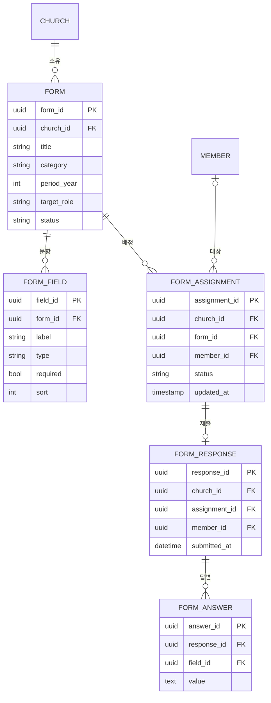

# 설문 · 보고 모듈 — 개발 명세 (Survey & Report Module)

> `church-saas-final-spec.md`의 **동반 모듈 문서**. 플랫폼 공통 규칙(멀티테넌트 `church_id` + RLS, Drizzle SQL-first, 무상태, JWT/RBAC, 복잡 쿼리는 raw SQL/뷰)을 모두 **상속**한다.

---

## 0. 요약

"설문"에는 성격이 다른 두 가지가 섞여 있어, **두 계층**으로 설계한다.

| 계층 | 무엇 | 배치 |
|---|---|---|
| **A. 범용 설문 엔진** | 피드백·행사 신청·의견 조사 등 누구에게나, 여러 모듈에서 재사용 | **공유(수평) 모듈** |
| **B. 역할 기반 보고** | 감리교 집사/권사/속장 보고서 등 직분 가진 교인이 연말 제출하는 정형 보고 | 엔진 위 + **교적 깊은 연동** |

핵심: **"교적 안이냐 따로냐"가 아니라, 엔진은 따로(공유) · 보고서는 교적과 함께(연동).**

---

## 1. 설계 원칙 / 배치

- **범용 설문 엔진은 공유 모듈로.** 교적 안에 가두면 행사·피드백·홈페이지(익명 입력)에서 재사용을 못 해 중복이 생긴다. 파일·알림처럼 **여러 모듈이 함께 쓰는 횡단 기능**.
- **역할 기반 보고는 엔진 위에 얹은 "교적 연동 보고 기능".** 직분(집사/권사/속장)으로 대상 자동 선정, 교인별 제출 현황·미제출 추적, 속/구역/부서별 집계, 연말 통계 롤업이 필요하므로 교적과 깊게 연동된다.
- **enum 값은 영문 코드 + 한글 라벨맵.** 플랫폼 컨벤션(`lib/members/constants.ts`의 `MEMBER_STATUSES`/`CARE_TYPES` + `*_LABELS` 패턴)을 따른다. **한글은 라벨에만, DB·코드 값은 영문 코드.** (§2 참조.)

---

## 2. 핵심 개념

- **`FORM`(템플릿):** 범용. `category`(설문/보고), `target_role`, `period_year` 등으로 용도를 구분.
- **`FORM_FIELD`:** 문항(타입 보유).
- **`FORM_ASSIGNMENT`:** 대상 교인 + **`status`(미제출/제출/검토완료)** — *미제출 추적의 핵심*.
- **`FORM_RESPONSE` / `FORM_ANSWER`:** 제출본 / 문항별 답변.
- **익명 설문:** `member_id`를 비워 처리(같은 엔진 재사용). 단, 공개 링크 익명 입력은 **접수(intake) 경계**를 따른다(§9).
- 집사/권사/속장 보고서 = `category="report"`, `target_role="class_leader"`, `period_year=2026`인 **FORM 템플릿일 뿐**이다.

### 2.1 enum 코드 정의 (영문 코드 / 한글 라벨)

모든 값은 영문 코드로 저장하고, 한글 라벨은 `lib/forms/constants.ts`의 라벨맵에서만 매핑한다.

| 코드 그룹 | 값(코드) | 한글 라벨 |
|---|---|---|
| `FORM_CATEGORIES` | `survey` / `report` | 설문 / 보고서 |
| `FORM_STATUSES` | `draft` / `published` / `closed` | 작성중 / 발행 / 마감 |
| `FIELD_TYPES` | `short_text` / `long_text` / `single_choice` / `multi_choice` / `number` / `date` / `scale` / `file` | 단답 / 장문 / 단일선택 / 다중선택 / 숫자 / 날짜 / 점수(척도) / 파일첨부 |
| `ASSIGNMENT_STATUSES` | `pending` / `submitted` / `reviewed` | 미제출 / 제출 / 검토완료 |

위 enum은 **시스템 고정**(교회가 못 바꿈) — 플랫폼이 정의한다.

반면 **`target_role`(직분/직책)은 시스템 고정이 아니라 교회 범위 마스터 테이블을 참조**한다. 직분·직책은 교단·교회마다 다르고 교회가 직접 추가하므로 **고정 enum으로 박지 않는다**(PRE-1/PRE-3).

| 참조 대상 | 무엇 | 구조 |
|---|---|---|
| 직분 (집사/권사/장로…) | 교회 전체 신분 | `position` 마스터(`church_id`) — 시드 + 교회 추가 |
| 조직 직책 (속장/부장/총무/회계…) | 특정 조직 내 역할 | `org_role` 마스터(`church_id`, `is_leader`) — 시드 + 교회 추가 |

> `pending` = 배정 직후 초기 상태(아직 미제출). 별도 "배정됨" 상태는 두지 않고 `pending`으로 통합한다.

---

## 3. ERD

> 모든 상태/구분/타입 컬럼은 **영문 코드 값**(§2.1). 아래 다이어그램의 `string` 컬럼은 해당 코드 그룹을 가리킨다.



- 모든 테이블에 `church_id` + RLS(플랫폼 규칙).
- 인덱스 예: `(church_id, form_id)`, `(church_id, form_id, status)`(제출현황 집계용).

---

## 4. 주요 기능

### 4.1 범용 설문 (계층 A)
- **폼 빌더** — 문항 타입(`FIELD_TYPES`): 단답 / 장문 / 단일선택 / 다중선택 / 숫자 / 날짜 / 점수(척도) / 파일첨부.
- **발행 / 마감**(`FORM_STATUSES`: draft → published → closed), 기간 설정.
- **대상 선정** — 전체 / 직분 / 구역·속 / 부서 / 개별, 또는 **익명(공개 링크 — 접수 패턴, §9)**.
- **응답 수집** + 결과 통계 / 내보내기(CSV·Excel).

### 4.2 역할 기반 보고 (계층 B · 감리교)
- **보고서 템플릿**(집사/권사/속장 등 `target_role`) + 대상 연도. *직분 코드는 PRE-1에서 코드화.*
- **직책 기반 자동 배정** — 예: 대상 = `속장`(org_role) + `period_year=2026` → **그 해 편성에서 해당 직책인 교인**(`org_membership` join `org_role`, period_year=2026, PRE-3)에게 `FORM_ASSIGNMENT(status="pending")` 자동 생성. "모든 리더"는 `org_role.is_leader=true`로 한 번에 타게팅.
  - 직분(전체 신분) 매칭은 **`position` 마스터(PRE-1)**, "그 해 어느 조직의 어떤 직책인가" 식별·조직 단위 집계는 **`org_membership`×`org_role`(PRE-3)** 기준. 둘 다 **교회가 추가 가능한 마스터**라 직책을 늘려도 대상·집계에 자동 반영.
- **교인별 제출 현황 대시보드**(`pending`/`submitted`), **미제출 독려**(알림톡 잡 — `lib/notify` + `lib/jobs` 재사용, §S.6).
- **검토 / 승인** 상태 관리(`reviewed`).
- **집계** — 속/구역/부서/직분별 + **연말 롤업**(교적 통계 연동).
- **Prefill** — 속장보고서는 교적의 **출석·심방·구역 데이터를 미리 채워** 중복 입력 최소화.

---

## 5. 교적 / 재정 연동

- **직분 · 속 · 구역**은 교적 데이터 참조(직분 코드, `department` 계층 구조).
- **Prefill**: 교적 출석·심방 데이터 → 보고서 초안.
- **헌금 항목**이 있으면 재정 모듈과 연동(선택).
- **집계 결과** → 교적 통계 보고서로 롤업, 필요 시 연회 보고 자료.

### 5.1 교적 선행과제 (계층 B 착수 전 필수)

계층 B(역할 기반 보고)는 "직분으로 대상 자동 선정 + 속/구역별 집계 + 속장 식별"이 핵심인데, **현재 교적 스키마로는 데이터에서 도출이 불가능하다.** 아래 보강을 먼저 처리해야 한다.

- **PRE-1. 직분 마스터(`position`)** — `member.position`이 현재 자유 텍스트(`lib/db/schema/members.ts`)다. 직분은 교단·교회마다 다르므로 **고정 enum이 아니라 교회 범위 마스터 테이블**로 둔다. 온보딩 때 기본 직분(집사/권사/장로/전도사…)을 **시드**하고 교회가 추가·수정·비활성·정렬할 수 있게 한다(RBAC `role` 시드와 동일 패턴). `member.position_id` FK.

```
position  (직분 마스터 — 교회 확장 가능)
  position_id PK, church_id, code, label, sort, active, timestamps
  unique  (church_id, code)
```

- **PRE-2. 속(class) 구조** — 별도 "속" 엔티티는 없고 `department`(부서/구역, 계층형 `parentId`)만 있다(`lib/db/schema/org.ts`). **속은 `department`의 하위 계층(구역 > 속)으로 모델링**한다 — 신규 테이블 불필요.
- **PRE-3. 연도별 조직 편성(`org_membership`)** — 핵심 보강. 현재는 `member.departmentId` **단일 FK**뿐이라 ① 연도별 이력 ② 다중 소속(속+여러 부서 동시) ③ 조직 내 역할(속장/속도원·부장/부원)을 담지 못한다. **속회는 매년 개편**(속장·속도원 재편성, 부서별 교인 등록)되므로, 연도 스코프 다대다 편성 테이블을 둔다.

```
org_role        (조직 직책 마스터 — 교회 확장 가능: 속장/부장/총무/회계/부원…)
  org_role_id PK, church_id, code, label, is_leader, sort, active, timestamps
  unique  (church_id, code)

org_membership  (조직 편성 — 그 해 누가 어느 조직에 어떤 직책으로)
  church_id, member_id, department_id, period_year, role_id FK→org_role, status, timestamps
  unique  (church_id, member_id, department_id, period_year)
  index   (church_id, department_id, period_year), (church_id, member_id, period_year)
```

  - **매년 개편** = 새 `period_year`로 새 편성 레코드 생성(작년 편성은 이력으로 보존).
  - **다중 소속** = 한 교인이 같은 해에 속·여러 부서 레코드를 동시 보유.
  - **직책은 고정이 아니라 추가 가능** — `org_role` 마스터에 교회가 직책을 늘릴 수 있고(시드 + 추가), `is_leader=true`인 직책(속장·부장…)이 "리더 보고서" 일괄 타게팅의 근거다. (단일 `department.head_member_id` 컬럼은 불필요 — 이 구조로 대체.)
  - `member.departmentId`는 "올해 주 소속(대표 속)" **캐시**로 유지하거나 폐기(원본은 `org_membership`).

> PRE-1~3은 교적(Phase 2) 위에 얹는 보강이며, **계층 A(범용 엔진)와는 무관**하므로 엔진은 먼저 진행할 수 있다. `FORM.period_year`가 `org_membership.period_year`와 맞물려 **그 해 편성 기준**으로 대상·집계가 정확히 떨어진다.

---

## 6. 워크플로우 — 연말 속장보고서 예시

1. **관리자:** "2026 속장보고서" 템플릿 생성(`category="report"`, 문항 정의) + 대상 = 직책 `속장`(org_role) · `period_year=2026`.
2. **시스템:** 대상 속장에게 `FORM_ASSIGNMENT(status="pending")` 자동 생성 + (선택)prefill.
3. **속장:** 로그인 → 작성·제출 → `status="submitted"`.
4. **관리자:** 제출현황 대시보드 확인, 미제출자에게 알림톡 독려(워커 잡).
5. **마감 후:** 속/구역별 집계, 연말 통계 / 연회 보고 자료 산출.

---

## 7. 권한 (RBAC)

- **템플릿 생성 / 배정 / 집계 열람** = 관리자·담당 역할.
- **제출** = 배정된 본인 교인만.
- **결과 열람** = 권한별(예: 속장은 자기 속, 관리자는 전체).

---

## 8. 빌드 순서 / 배치

- **범용 엔진(계층 A)**은 작게 먼저 구현 가능.
- **역할 기반 보고(계층 B)**는 **교적 선행과제(PRE-1~3, §5.1)를 먼저 처리한 직후**가 자연스럽다. (교적 Phase 2 위에 얹는 소규모 보강.)
- 플랫폼 **모듈 6단계 패턴**을 따른다: 스키마 → RLS → 로직 → API/가드 → 화면 → 격리·권한 테스트.

```
PRE.0 교적 선행보강(직분/직책 마스터[교회 확장] + 속=department 계층 + 연도별 org_membership 편성)
   └─> (계층 B) 역할 기반 보고
(계층 A) 범용 설문 엔진  ── PRE.0와 독립, 먼저 진행 가능
```

---

## 9. 코딩 규칙 (플랫폼 상속 + 모듈 특화)

- 모든 테이블 `church_id`, 모든 접근 **RLS 경유**.
- **enum 값은 영문 코드 + 한글 라벨맵**(`lib/forms/constants.ts`). DB·코드에 한글 리터럴 금지(§2.1).
- **복잡 집계는 raw SQL / Postgres 뷰**(예: 속별 제출률, 문항별 응답 분포, 직분별 집계).
- **익명 공개 설문 = 접수(intake) 경계.** 익명 링크 응답은 미인증 입력이므로 불변규칙 #6(공개 영역은 발행 콘텐츠/접수 테이블만 접근)에 따라 `NEWFAMILY_REQ`·`ONLINE_OFFERING`과 동일한 **intake 패턴**으로 취급한다.
  - 공개 영역(`app/(public)`)에서 접근하는 것은 **발행된(`published`) `FORM` 읽기 + 익명 `FORM_RESPONSE` 쓰기**뿐.
  - `church_id`는 JWT가 아니라 **호스트/사이트 테넌트 컨텍스트(`proxy` 해석)**로 RLS 세션변수에 주입한다.
  - **비익명(교인 배정) 설문·보고는 인증 영역(`app/(app)`)에서만.** 민감/개인 식별 응답을 공개 경로로 노출 금지.
- 익명 설문은 `member_id` 비움 + 개인정보 최소 수집.
- 보고서에 민감 항목이 있으면(헌금 등) 취급·노출 권한 보수적으로.

---

## 10. Claude Code 작업 분해 (예시)

| # | 작업 | 완료 기준 |
|---|---|---|
| **PRE.0** | 교적 선행보강: 직분/직책 **마스터**(`position`·`org_role`, 교회 추가 가능·시드)(PRE-1) + 속=`department` 계층(PRE-2) + **연도별 `org_membership` 편성**(PRE-3) | 마이그레이션, 연도별 편성·다중소속·직책 식별, 직책 추가시 대상·집계 자동반영, 격리 유지 *(계층 B 선행)* |
| **S.1** | 설문 엔진 스키마(FORM/FIELD/ASSIGNMENT/RESPONSE/ANSWER) + RLS + enum 코드/라벨맵 | 마이그레이션, church_id·인덱스, RLS 격리, `lib/forms/constants.ts` |
| **S.2** | 폼 빌더(문항 타입) + 발행/마감/대상 선정 | 템플릿 생성·발행 동작 |
| **S.3** | 응답 제출/수집 (익명 포함) | 제출 저장, 익명은 **intake 경계**(공개 라우트·테넌트 컨텍스트 주입, §9) |
| **S.4** | 역할 기반 자동 배정(직분 타게팅) + 제출현황 대시보드 *(PRE.0 의존)* | 대상 자동 생성(`pending`), 제출/미제출 집계 |
| **S.5** | 집계/통계 + 내보내기 (raw SQL/뷰) | 속/구역/직분별 집계, CSV/Excel *(내보내기 인프라 신규)* |
| **S.6** | 미제출 독려 알림톡 잡(워커) | 미제출자 대상 발송 — `lib/notify` + `lib/jobs`/`jobs/worker.ts`(pg-boss) **재사용** |
| **S.7** | 격리·권한 통합 테스트 | 타교회·무권한 접근 차단, 공개/익명 경계 검증 |

---

_본 문서는 `church-saas-final-spec.md`의 모듈 명세이다. 모듈 범위·로드맵 변경 시 최종 명세서와 함께 갱신한다._

_개정: ① 교적 선행과제(PRE-1~3, §5.1) 추가 — 속장 자동 배정/속별 집계 데이터 모델. ② enum 값 영문 코드화 + 한글 라벨맵(§2.1). ③ 익명 공개 설문 = 접수(intake) 경계 명시(§9). ④ PRE-3을 **연도별 조직 편성(`org_membership`)** 으로 강화 — 매년 속회 개편(속장·속도원 재편성)·다중 소속·이력을 담고, `period_year` 기준 보고서 타게팅과 맞물림. ⑤ 직분·직책을 고정 enum이 아니라 **교회 확장 가능 마스터(`position`·`org_role`, 시드+추가)** 로 — 교단·교회별 차이 수용(시스템 고정 enum은 카테고리·문항타입·상태에 한정)._
